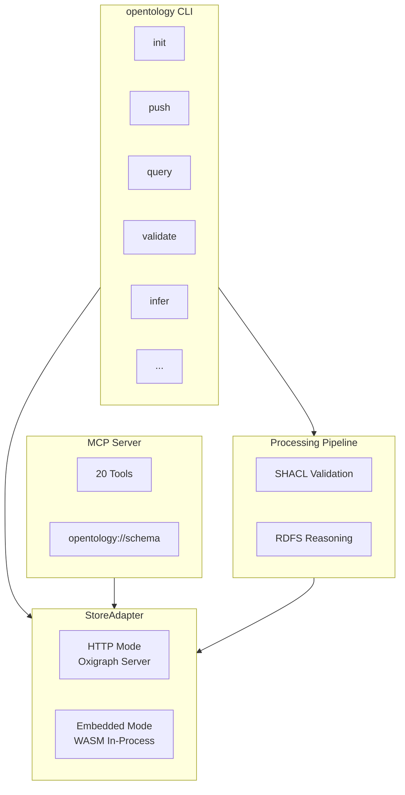
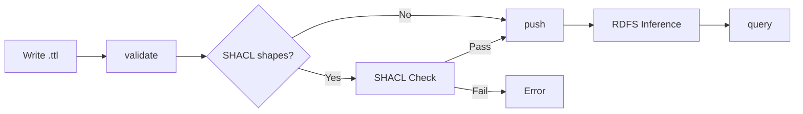
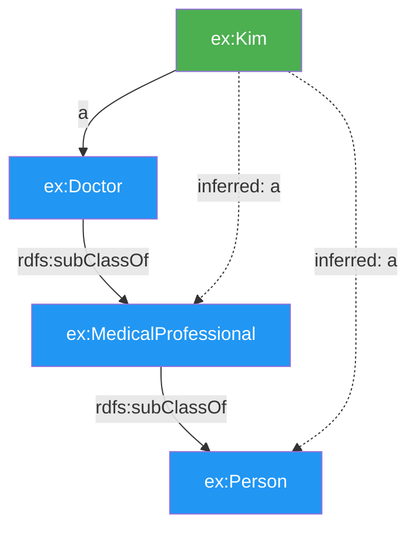

# OpenTology

> CLI-managed RDF/SPARQL infrastructure with RDFS reasoning, SHACL validation, and interactive graph visualization -- Supabase for knowledge graphs

[English](#english) | [한국어](#한국어)

---

## English

### Architecture



Existing ontology tools have terrible developer experience. OpenTology gives you managed RDF with a simple CLI -- initialize a project, write Turtle, validate with SHACL, push with automatic RDFS inference, query, and visualize your graph in an interactive web UI, all from your terminal. It ships an MCP server so AI assistants can manage your knowledge graph directly. It runs in embedded mode with zero Docker dependency, or connects to an Oxigraph server over HTTP.

### System Requirements

- **Node.js** >= 20.0.0
- **oxigraph** uses WebAssembly (WASM) — platform-independent, runs everywhere Node.js runs. No C++ compiler, Python, or native build tools needed.

### Quick Demo

```bash
# Zero-install embedded mode (no Docker!)
opentology init --embedded my-project

# Define ontology with class hierarchy
cat > ontology.ttl << 'EOF'
@prefix rdfs: <http://www.w3.org/2000/01/rdf-schema#> .
@prefix ex: <http://example.org/> .
ex:Person a rdfs:Class .
ex:Doctor rdfs:subClassOf ex:Person .
ex:Kim a ex:Doctor ; ex:name "Dr. Kim" .
ex:Lee a ex:Person ; ex:name "Lee" .
EOF

# Push with automatic RDFS inference
opentology push ontology.ttl
# -> Pushed 6 triples
# -> Inferred 1 additional triples

# Query: Doctor instances found as Person (inference!)
opentology query 'SELECT ?name WHERE { ?p a ex:Person . ?p ex:name ?name }'
# -> Kim, Lee  (Kim is a Doctor, but inferred as Person)
```

### Push Pipeline



### Why OpenTology?

| | OpenTology | Raw Oxigraph | Neo4j |
|---|---|---|---|
| Setup | `npm install -g opentology` | Manual binary/Docker config | Server install + license |
| Docker required | No (embedded mode) | Yes | Yes |
| RDFS reasoning | Automatic on push | Manual SPARQL CONSTRUCT | Not native |
| SHACL validation | Built-in | Manual tooling | N/A |
| AI integration | MCP server with 20 tools | None | Plugin ecosystem |
| Query language | SPARQL (auto-prefixed) | SPARQL (raw) | Cypher |
| Data format | Turtle files | Turtle/N-Triples | Property graph |
| Project scoping | Automatic named graphs | Manual | Database-level |

### Features

**Core**

- 16 CLI commands covering the full RDF lifecycle
- Project-level configuration with `.opentology.json`
- Named graph scoping -- queries are automatically scoped to your project
- Two modes: HTTP (Oxigraph server) and embedded (WASM, zero Docker)
- Prefix registry with auto-injection into SPARQL queries

**Reasoning**

- RDFS inference: subClassOf, subPropertyOf, domain, range
- Query `Person` and get `Doctor` instances automatically
- Auto-materialization on push, manual control with `infer`

**Validation**

- Turtle syntax validation before every push
- SHACL shape constraint validation
- `shapes/` directory convention for organizing shape files

**AI Integration**

- MCP server with 20 tools and 1 resource
- `opentology://schema` resource auto-loads ontology overview
- Works with Claude Code, Cursor, and any MCP-compatible client

**Visualization**

- Interactive graph visualization web UI (`opentology context graph`)
- Explore classes, instances, and relationships visually with vis-network
- SPARQL query editor, node filtering, search, and focus mode

### Two Modes

| | HTTP Mode | Embedded Mode |
|---|---|---|
| Backend | Oxigraph server (Docker or binary) | In-process WASM store |
| Docker | Required | Not required |
| Init | `opentology init my-project` | `opentology init --embedded my-project` |
| Source of truth | Oxigraph server | Local `.ttl` files |
| Best for | Production, shared access | Local dev, quick experiments |
| Performance | Server-grade | Single-user |

### Installation

```bash
npm install -g opentology
```

**Prerequisites:** Node.js 20+

For HTTP mode, you also need Oxigraph running:

```bash
docker run -p 7878:7878 ghcr.io/oxigraph/oxigraph \
  serve --location /data --bind 0.0.0.0:7878
```

For embedded mode, no additional setup is needed.

### CLI Commands

| Command | Description |
|---------|-------------|
| `opentology init [project-id]` | Initialize project (`--embedded` for Docker-free mode) |
| `opentology validate <file>` | Validate Turtle syntax (`--shacl` for SHACL validation) |
| `opentology push <file>` | Push triples with auto SHACL validation and RDFS inference (`--replace`, `--no-shacl`, `--no-infer`) |
| `opentology query <sparql>` | Run SPARQL with auto prefix injection (`--format table\|json\|csv`, `--raw`) |
| `opentology status` | Show asserted/inferred/total triple counts (file count in embedded mode) |
| `opentology pull` | Export project graph as Turtle |
| `opentology drop` | Drop the entire project graph (`--force` to skip confirmation) |
| `opentology delete <file>` | Delete triples from a file or by pattern (`--where`) |
| `opentology diff <file>` | Compare local Turtle file against the graph |
| `opentology shapes` | List or show SHACL shapes |
| `opentology infer` | Run RDFS materialization (`--clear` to remove inferred triples) |
| `opentology graph` | List, create, or drop named graphs |
| `opentology prefix` | List, add, or remove project prefixes |
| `opentology context` | Project context management (`init`, `load`, `status`, `scan`, `graph`) |
| `opentology viz` | Visualize ontology schema (`schema`) |
| `opentology mcp` | Start the MCP server |

### MCP Integration

Add to your MCP client configuration (`.mcp.json`):

```json
{
  "mcpServers": {
    "opentology": {
      "command": "npx",
      "args": ["opentology", "mcp"]
    }
  }
}
```

**20 Tools:**

| Tool | Description |
|------|-------------|
| `opentology_init` | Initialize a project |
| `opentology_validate` | Validate Turtle content |
| `opentology_push` | Validate and push triples |
| `opentology_query` | Execute SPARQL queries |
| `opentology_status` | Get project status |
| `opentology_pull` | Export graph as Turtle |
| `opentology_drop` | Drop project graph |
| `opentology_delete` | Delete triples |
| `opentology_diff` | Compare local vs graph |
| `opentology_schema` | Introspect ontology schema |
| `opentology_infer` | Run RDFS inference |
| `opentology_graph_list` | List named graphs |
| `opentology_graph_create` | Create a named graph |
| `opentology_graph_drop` | Drop a named graph |
| `opentology_visualize` | Generate schema visualization (Mermaid/DOT) |
| `opentology_context_init` | Initialize project context graph |
| `opentology_context_load` | Load project context |
| `opentology_context_status` | Check context initialization status |
| `opentology_context_scan` | Scan codebase (module or symbol-level) |
| `opentology_context_graph` | Start interactive graph visualization web UI |

**1 Resource:**

| Resource | Description |
|----------|-------------|
| `opentology://schema` | Auto-loaded ontology overview (classes, properties, instances) |

### RDFS Reasoning

OpenTology automatically materializes RDFS inferences when you push data. If your ontology defines a class hierarchy, queries against a parent class return instances of all subclasses.



Supported inference rules:

- **rdfs:subClassOf** -- instances of subclass are instances of superclass
- **rdfs:subPropertyOf** -- triples with subproperty imply triples with superproperty
- **rdfs:domain** -- using a property implies the subject is of the domain class
- **rdfs:range** -- using a property implies the object is of the range class

Use `opentology infer` to manually trigger materialization, or `opentology infer --clear` to remove inferred triples.

### SHACL Validation

Place shape files in the `shapes/` directory. They are automatically validated on push.

```turtle
# shapes/person-shape.ttl
@prefix sh: <http://www.w3.org/ns/shacl#> .
@prefix ex: <http://example.org/> .

ex:PersonShape a sh:NodeShape ;
  sh:targetClass ex:Person ;
  sh:property [
    sh:path ex:name ;
    sh:minCount 1 ;
    sh:datatype xsd:string ;
  ] .
```

```bash
# Validate explicitly
opentology validate --shacl data.ttl

# Push auto-validates (skip with --no-shacl)
opentology push data.ttl

# List available shapes
opentology shapes
```

### Deep Scan (Symbol-Level Analysis)

The `opentology_context_scan` MCP tool supports symbol-level deep scanning that extracts classes, interfaces, functions, and method call relationships from source code, then pushes them as OTX triples to the context graph.

**Supported Languages:**

| Language | Engine | Symbols Extracted |
|----------|--------|-------------------|
| TypeScript/JavaScript | ts-morph | class, interface, function, method calls |
| Python | Tree-sitter | class, ABC/Protocol, function, method calls |
| Go | Tree-sitter | struct, interface, func, method calls |
| Rust | Tree-sitter | struct, trait, impl, fn, method calls |
| Java | Tree-sitter | class, interface, method, method calls |
| Swift | Tree-sitter | class, struct, protocol, func, method calls |

**Optional Dependencies:**

```bash
# For TypeScript/JavaScript deep scan
npm install ts-morph

# For Python/Go/Rust/Java/Swift deep scan
npm install web-tree-sitter tree-sitter-wasms
```

**Usage (MCP):**

```json
{
  "depth": "symbol",
  "includeMethodCalls": true,
  "languages": ["typescript", "python"]
}
```

### Tech Stack

- TypeScript, commander.js, n3.js
- Oxigraph WASM (embedded mode) / Oxigraph server (HTTP mode)
- @modelcontextprotocol/sdk for MCP server
- shacl-engine for SHACL validation
- picocolors for terminal output
- ts-morph (optional) for TypeScript symbol analysis
- web-tree-sitter + tree-sitter-wasms (optional) for multi-language symbol analysis

### Roadmap

- [x] CLI with 16 commands
- [x] MCP server with 20 tools and 1 resource
- [x] Schema introspection (MCP resource + tool)
- [x] Complete CRUD (push --replace, drop, delete)
- [x] SHACL validation (shape constraints on push)
- [x] DX polish (diff, colors, better errors)
- [x] Multi-graph support
- [x] Prefix management
- [x] Embedded mode (no Docker required)
- [x] RDFS reasoning (auto-materialization on push)
- [x] Multi-language deep scan (TypeScript, Python, Go, Rust, Java, Swift)
- [ ] OWL reasoning (owl:sameAs, owl:inverseOf)
- [ ] Remote ontology import
- [ ] Version control for ontology snapshots
- [x] Interactive graph visualization web UI

### Contributing

1. Fork the repository
2. Create a feature branch (`git checkout -b feature/my-feature`)
3. Commit your changes
4. Open a Pull Request

### License

MIT

---

## 한국어

### 아키텍처


온톨로지 도구들은 개발자 경험이 열악합니다. OpenTology는 터미널에서 RDF의 전체 생애주기를 관리합니다. 프로젝트 초기화, Turtle 작성, SHACL 검증, RDFS 추론이 포함된 푸시, SPARQL 쿼리, 인터랙티브 그래프 시각화까지 CLI 하나로 처리합니다. MCP 서버를 내장하고 있어 AI 어시스턴트가 지식 그래프를 직접 다룰 수 있고, Docker 없이 임베디드 모드로 바로 시작할 수 있습니다.

### 시스템 요구사항

- **Node.js** >= 20.0.0
- **oxigraph**는 WebAssembly(WASM)를 사용하므로 플랫폼 독립적입니다. Node.js가 실행되는 모든 환경에서 동작하며, C++ 컴파일러, Python, 또는 네이티브 빌드 도구가 필요하지 않습니다.

### 빠른 시작

```bash
# Docker 없이 바로 시작 (임베디드 모드)
opentology init --embedded my-project

# 클래스 계층 구조가 포함된 온톨로지 작성
cat > ontology.ttl << 'EOF'
@prefix rdfs: <http://www.w3.org/2000/01/rdf-schema#> .
@prefix ex: <http://example.org/> .
ex:Person a rdfs:Class .
ex:Doctor rdfs:subClassOf ex:Person .
ex:Kim a ex:Doctor ; ex:name "Dr. Kim" .
ex:Lee a ex:Person ; ex:name "Lee" .
EOF

# RDFS 추론 포함 자동 푸시
opentology push ontology.ttl
# -> Pushed 6 triples
# -> Inferred 1 additional triples

# Doctor를 Person으로 자동 추론하여 결과에 포함
opentology query 'SELECT ?name WHERE { ?p a ex:Person . ?p ex:name ?name }'
# -> Kim, Lee  (Kim은 Doctor이지만 Person으로 추론됨)
```

### 푸시 파이프라인


### OpenTology를 쓰는 이유

| | OpenTology | Oxigraph 직접 사용 | Neo4j |
|---|---|---|---|
| 설치 | `npm install -g opentology` | 바이너리/Docker 직접 구성 | 서버 설치 + 라이선스 |
| Docker 필수 | 아니오 (임베디드 모드) | 예 | 예 |
| RDFS 추론 | 푸시 시 자동 | SPARQL CONSTRUCT 수동 작성 | 네이티브 미지원 |
| SHACL 검증 | 내장 | 별도 도구 필요 | 해당 없음 |
| AI 연동 | MCP 서버 20개 도구 | 없음 | 플러그인 생태계 |
| 쿼리 언어 | SPARQL (접두사 자동 삽입) | SPARQL (수동) | Cypher |
| 데이터 형식 | Turtle 파일 | Turtle/N-Triples | 속성 그래프 |
| 프로젝트 구분 | Named Graph 자동 | 수동 관리 | 데이터베이스 단위 |

### 주요 기능

**핵심**

- RDF 전체 생애주기를 다루는 16개 CLI 명령어
- `.opentology.json` 기반 프로젝트 설정
- Named Graph 자동 스코핑 -- 쿼리가 프로젝트 그래프에 자동 한정
- HTTP 모드(Oxigraph 서버)와 임베디드 모드(WASM, Docker 불필요) 지원
- 프로젝트 수준 접두사 레지스트리, SPARQL 쿼리에 자동 삽입

**추론**

- RDFS 추론: subClassOf, subPropertyOf, domain, range
- `Person`을 쿼리하면 `Doctor` 인스턴스도 자동 포함
- 푸시 시 자동 물질화, `infer` 명령어로 수동 제어

**검증**

- 푸시 전 Turtle 문법 자동 검증
- SHACL 형상 제약 조건 검증
- `shapes/` 디렉토리 규칙으로 형상 파일 관리

**AI 연동**

- 20개 도구와 1개 리소스를 제공하는 MCP 서버
- `opentology://schema` 리소스로 온톨로지 개요 자동 로드
- Claude Code, Cursor 등 MCP 호환 클라이언트와 연동

**시각화**

- 인터랙티브 그래프 시각화 웹 UI (`opentology context graph`)
- vis-network로 클래스, 인스턴스, 관계를 시각적으로 탐색
- SPARQL 쿼리 편집기, 노드 필터링, 검색, 포커스 모드

### 두 가지 모드

| | HTTP 모드 | 임베디드 모드 |
|---|---|---|
| 백엔드 | Oxigraph 서버 (Docker 또는 바이너리) | 인프로세스 WASM 스토어 |
| Docker | 필요 | 불필요 |
| 초기화 | `opentology init my-project` | `opentology init --embedded my-project` |
| 원본 데이터 | Oxigraph 서버 | 로컬 `.ttl` 파일 |
| 적합한 용도 | 프로덕션, 공유 환경 | 로컬 개발, 빠른 실험 |
| 성능 | 서버급 | 단일 사용자 |

### 설치

```bash
npm install -g opentology
```

**필수 조건:** Node.js 20+

HTTP 모드를 사용하려면 Oxigraph 서버가 필요합니다:

```bash
docker run -p 7878:7878 ghcr.io/oxigraph/oxigraph \
  serve --location /data --bind 0.0.0.0:7878
```

임베디드 모드는 추가 설치가 필요 없습니다.

### CLI 명령어

| 명령어 | 설명 |
|--------|------|
| `opentology init [project-id]` | 프로젝트 초기화 (`--embedded`로 Docker 불필요 모드) |
| `opentology validate <file>` | Turtle 문법 검증 (`--shacl`로 SHACL 검증) |
| `opentology push <file>` | SHACL 자동 검증 + RDFS 추론 포함 푸시 (`--replace`, `--no-shacl`, `--no-infer`) |
| `opentology query <sparql>` | 접두사 자동 삽입 SPARQL 실행 (`--format table\|json\|csv`, `--raw`) |
| `opentology status` | asserted/inferred/total 트리플 수 표시 (임베디드 모드에서 파일 수 포함) |
| `opentology pull` | 프로젝트 그래프를 Turtle로 내보내기 |
| `opentology drop` | 프로젝트 그래프 전체 삭제 (`--force`로 확인 생략) |
| `opentology delete <file>` | 파일 또는 패턴(`--where`)으로 트리플 삭제 |
| `opentology diff <file>` | 로컬 Turtle 파일과 그래프 비교 |
| `opentology shapes` | SHACL 형상 목록 조회/상세 보기 |
| `opentology infer` | RDFS 물질화 실행 (`--clear`로 추론 트리플 제거) |
| `opentology graph` | Named Graph 목록/생성/삭제 |
| `opentology prefix` | 프로젝트 접두사 목록/추가/제거 |
| `opentology context` | 프로젝트 컨텍스트 관리 (`init`, `load`, `status`, `scan`, `graph`) |
| `opentology viz` | 온톨로지 스키마 시각화 (`schema`) |
| `opentology mcp` | MCP 서버 시작 |

### MCP 연동

MCP 클라이언트 설정 파일(`.mcp.json`)에 추가:

```json
{
  "mcpServers": {
    "opentology": {
      "command": "npx",
      "args": ["opentology", "mcp"]
    }
  }
}
```

**20개 도구:**

| 도구 | 설명 |
|------|------|
| `opentology_init` | 프로젝트 초기화 |
| `opentology_validate` | Turtle 내용 검증 |
| `opentology_push` | 트리플 검증 및 푸시 |
| `opentology_query` | SPARQL 쿼리 실행 |
| `opentology_status` | 프로젝트 상태 조회 |
| `opentology_pull` | 그래프를 Turtle로 내보내기 |
| `opentology_drop` | 프로젝트 그래프 삭제 |
| `opentology_delete` | 트리플 삭제 |
| `opentology_diff` | 로컬 파일과 그래프 비교 |
| `opentology_schema` | 온톨로지 스키마 조회 |
| `opentology_infer` | RDFS 추론 실행 |
| `opentology_graph_list` | Named Graph 목록 조회 |
| `opentology_graph_create` | Named Graph 생성 |
| `opentology_graph_drop` | Named Graph 삭제 |
| `opentology_visualize` | 스키마 시각화 생성 (Mermaid/DOT) |
| `opentology_context_init` | 프로젝트 컨텍스트 그래프 초기화 |
| `opentology_context_load` | 프로젝트 컨텍스트 로드 |
| `opentology_context_status` | 컨텍스트 초기화 상태 확인 |
| `opentology_context_scan` | 코드베이스 스캔 (모듈/심볼 수준) |
| `opentology_context_graph` | 인터랙티브 그래프 시각화 웹 UI 시작 |

**1개 리소스:**

| 리소스 | 설명 |
|--------|------|
| `opentology://schema` | 온톨로지 개요 자동 로드 (클래스, 속성, 인스턴스) |

### RDFS 추론

데이터를 푸시하면 RDFS 추론이 자동으로 물질화됩니다. 온톨로지에 클래스 계층이 정의되어 있으면, 상위 클래스를 쿼리할 때 하위 클래스의 인스턴스도 함께 반환됩니다.


지원하는 추론 규칙:

- **rdfs:subClassOf** -- 하위 클래스의 인스턴스는 상위 클래스의 인스턴스
- **rdfs:subPropertyOf** -- 하위 속성의 트리플은 상위 속성의 트리플을 함의
- **rdfs:domain** -- 속성 사용 시 주어가 도메인 클래스의 인스턴스임을 함의
- **rdfs:range** -- 속성 사용 시 목적어가 범위 클래스의 인스턴스임을 함의

`opentology infer`로 수동 물질화, `opentology infer --clear`로 추론 트리플 제거가 가능합니다.

### SHACL 검증

`shapes/` 디렉토리에 형상 파일을 배치하면 푸시 시 자동으로 검증됩니다.

```turtle
# shapes/person-shape.ttl
@prefix sh: <http://www.w3.org/ns/shacl#> .
@prefix ex: <http://example.org/> .

ex:PersonShape a sh:NodeShape ;
  sh:targetClass ex:Person ;
  sh:property [
    sh:path ex:name ;
    sh:minCount 1 ;
    sh:datatype xsd:string ;
  ] .
```

```bash
# 명시적 검증
opentology validate --shacl data.ttl

# 푸시 시 자동 검증 (--no-shacl로 생략 가능)
opentology push data.ttl

# 등록된 형상 목록 조회
opentology shapes
```

### 딥스캔 (심볼 수준 분석)

`opentology_context_scan` MCP 도구는 소스 코드에서 클래스, 인터페이스, 함수, 메서드 호출 관계를 추출하여 OTX 트리플로 컨텍스트 그래프에 푸시하는 심볼 수준 딥스캔을 지원합니다.

**지원 언어:**

| 언어 | 엔진 | 추출 심볼 |
|------|------|-----------|
| TypeScript/JavaScript | ts-morph | class, interface, function, method calls |
| Python | Tree-sitter | class, ABC/Protocol, function, method calls |
| Go | Tree-sitter | struct, interface, func, method calls |
| Rust | Tree-sitter | struct, trait, impl, fn, method calls |
| Java | Tree-sitter | class, interface, method, method calls |
| Swift | Tree-sitter | class, struct, protocol, func, method calls |

**선택적 의존성:**

```bash
# TypeScript/JavaScript 딥스캔
npm install ts-morph

# Python/Go/Rust/Java/Swift 딥스캔
npm install web-tree-sitter tree-sitter-wasms
```

**사용법 (MCP):**

```json
{
  "depth": "symbol",
  "includeMethodCalls": true,
  "languages": ["typescript", "python"]
}
```

### 기술 스택

- TypeScript, commander.js, n3.js
- Oxigraph WASM (임베디드 모드) / Oxigraph 서버 (HTTP 모드)
- @modelcontextprotocol/sdk (MCP 서버)
- shacl-engine (SHACL 검증)
- picocolors (터미널 출력)
- ts-morph (선택) TypeScript 심볼 분석
- web-tree-sitter + tree-sitter-wasms (선택) 다중 언어 심볼 분석

### 로드맵

- [x] 16개 CLI 명령어
- [x] 20개 도구와 1개 리소스를 갖춘 MCP 서버
- [x] 스키마 조회 (MCP 리소스 + 도구)
- [x] 완전한 CRUD (push --replace, drop, delete)
- [x] SHACL 검증 (푸시 시 형상 제약 자동 검증)
- [x] DX 개선 (diff, 컬러 출력, 에러 메시지)
- [x] 멀티 그래프 지원
- [x] 접두사 관리
- [x] 임베디드 모드 (Docker 불필요)
- [x] RDFS 추론 (푸시 시 자동 물질화)
- [x] 다중 언어 딥스캔 (TypeScript, Python, Go, Rust, Java, Swift)
- [ ] OWL 추론 (owl:sameAs, owl:inverseOf)
- [ ] 원격 온톨로지 임포트
- [ ] 온톨로지 스냅샷 버전 관리
- [x] 인터랙티브 그래프 시각화 웹 UI

### 기여 방법

1. 저장소를 포크합니다
2. 기능 브랜치를 만듭니다 (`git checkout -b feature/my-feature`)
3. 변경사항을 커밋합니다
4. Pull Request를 열어주세요

### 라이선스

MIT
